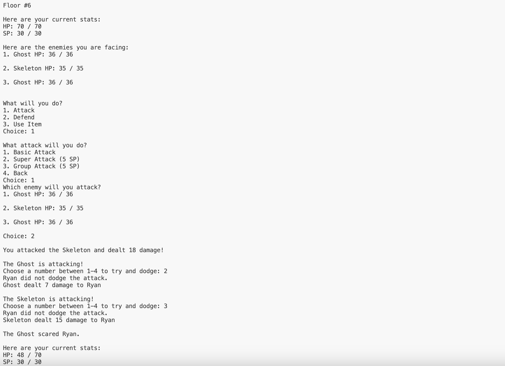

## Author
Ryan McKinnon

## Name
RPG Battle Tower

## Description
A Text-based game with gameplay like a turn-based RPG. You climb floors of an endless battle tower, fighting randomly generated enemies as you go. You choose between attacking, defending, or using items. Every five floors you encounter a boss. Upon defeating the boss, you level up and get a stat boost in all areas, and get to choose a further boost in one area from three randomly generated choices. Makes use of numerous Object-Oriented Programming concepts like inheritance, polymorphism, and method overloading + overriding.

## Visuals
Basic Turn Image:

Boss Turn  Image:

Level Up Image:

## Roadmap
Hero classes as well as enemy classes. 
Adding a GUI to this game instead of it just being text-based.
Possible online leaderboard component.

## Project status
Stopped for the time being.
